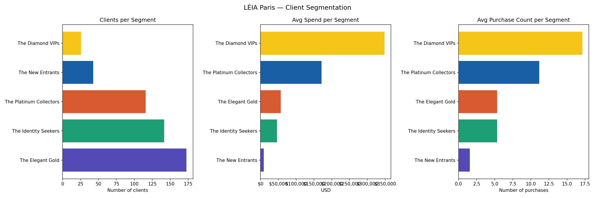

# LÉIA Intelligence Suite — Paris Boutique

AI-powered intelligence suite for a luxury jewelry maison: RAG chatbot, analytics dashboard & ML prediction models

> **Luxury retail meets artificial intelligence**


---

## Context

LÉIA is a fictional Parisian luxury jewelry maison. 
This project asks one question: what if every team in a high-end boutique had an AI built exactly for them?

A chatbot that helps advisors know their clients, anticipate their needs, and deliver the right answer 
at the right moment. A dashboard that turns sales data into decisions. And a machine learning layer that 
predicts what clients want before they walk through the door.

The Paris boutique was chosen deliberately: Paris is the reference market for luxury jewelry globally, and its international clientele, 28% Asian, 22% French, 18% Middle Eastern, 16% American, mirrors the complexity of real luxury retail operations.

Three tools were designed and built:
- A **multi-persona RAG chatbot** giving every team instant access to brand knowledge and client insights
- An **analytics dashboard** turning sales and client data into actionable business intelligence
- A **machine learning suite** predicting client behavior, recommending pieces, and surfacing sales trends

---

## Product Roadmap

### 1. Discovery — Problem Identification & User Needs

**"What are the real issues that luxury retail teams face on a daily basis, and what can be improved?"**

An analysis of the operational reality of a Paris luxury boutique revealed three main friction points:

**For field teams (boutique advisors, after-sales):**
- No instant access to product knowledge, brand storytelling, or policies during client interactions: information scattered across PDFs, emails, training decks, and intranets
- Training provided at onboarding and updated only at each new collection release, leaving gaps in between
- The real bottleneck: advisors have context but no support to turn it into a confident, personalized interaction at the right moment

**For office teams (CRM, marketing, product):**
- Fragmented sales and client data making personalization at scale difficult
- No unified view of performance
- Cannot provide real-time answers to field teams, creating bottlenecks on both sides

**For the organization:**
- Inconsistent brand messaging with no guarantee that DNA is conveyed accurately at every touchpoint
- Knowledge gaps are invisible: a wrong answer on warranty, materials, or policy is a brand trust failure
- No predictive capability: teams react to trends rather than anticipate them

### 2. Problem Statement

> In luxury retail, there is no room for hesitation. An advisor who fumbles on a gemstone detail, misquotes a warranty, or fails to recall a client's last purchase doesn't just lose a sale, they damage the brand.

>Yet collections change constantly, client profiles multiply, and policies evolve. Advisors are expected to know everything, instantly, with no cheat sheet allowed.

>Behind the scenes, office teams face the opposite problem: too much data, not enough signal. Sales figures sit in spreadsheets, client insights stay locked in advisors' heads, and decisions get made on instinct rather than evidence.

>The goal: give every persona the right information at the right moment, and replace instinct with intelligence.

### 3. Product Vision

#### The brand as a design constraint

Founded in 2013, the year France legalized marriage equality, LÉIA was built around one core idea: **jewelry as emancipation, as a mirror of identity**.

The maison expresses this vision through four collections:

| Collection | Philosophy |
|-----------|------------|
| **Amazon** | Unapologetic feminine power: bold, visible, commanding |
| **Hatching** | Quiet strength: delicate but unbreakable, soft yet architectural |
| **Eclipse** | Beyond definition: designed for non-binary and gender-fluid individuals |
| **Vanta** | Tech minimalism: time reimagined, function without decoration |

> *"At LÉIA, femininity is vast. Powerful with Amazon. Poetic with Hatching. Boundless with Eclipse."*

---

#### Market research that informed the data architecture

A luxury jewelry market study of the Paris boutique revealed the nationality breakdown of international buyers, which directly shaped the synthetic dataset:

| Origin | Share | Avg basket | Key behavioral signal |
|--------|-------|------------|----------------------|
| Asia-Pacific | 28% | €6,800 (China) | Daigou behavior, WeChat influence, social media driven |
| France | 22% | €3,600 | Local loyalty, self-gift culture, milestone purchases |
| Middle East | 18% | €8,200 | Highest basket, biannual visits, celebration-driven |
| Americas | 16% | €5,400 | Stable growth, Amex payment, expat community |
| Europe excl. FR | 12% | €3,100 | Art/design events, post-Brexit tax incentive |
| Other | 4% | — | Emerging segments (India, Africa) |

This breakdown informed the generation of a **500-client synthetic dataset** with realistic behavioral rules encoded by nationality, occasion, and purchase pattern.

---

#### Knowledge architecture

Eight documents structured into a queryable knowledge base:

| Document | What it enables |
|----------|----------------|
| `brand_story.txt` | Brand DNA, values, founding story, collection philosophy |
| `boutique_guidelines.txt` | Service standards, client journey, advisor training |
| `after_sales_policy.txt` | Warranty, repairs, returns, trade-in program |
| `care_instructions.txt` | Material-specific care by metal, stone, and product type |
| `boutique_innovation.txt` | Two original phygital retail concepts |
| `leia_products.csv` | 42 products: materials, prices, gemstones, craftsmanship |
| `purchase_history_3500.csv` | 3,508 transactions: Paris boutique |
| `client_profiles_500.csv` | 500 clients: VIP tiers, preferences, purchase history, birthdate |

**`boutique_innovation.txt`** documents two original phygital concepts:
- **Chrysalis Room** a private in-store space with programmable environment (lighting, scent, sound) and an encrypted digital memory capsule tied to each purchase
- **Constellation Wall** a touchscreen installation displaying real client stories, filterable by collection, theme, and occasion

### 4. OKRs

**Objective 1 — Empower field and office teams with instant access to brand knowledge**

| Key Result | Target |
|-----------|--------|
| KR1 | Reduce average time to find product or policy information from ~5 min to <30 sec |
| KR2 | Deliver consistent, brand-accurate answers across all 5 user personas |
| KR3 | Cover 100% of knowledge base documents in RAG retrieval |
| KR4 | Enable advisors to prepare personalized client outreach in <1 min using client data |

**Objective 2 — Give managers and office teams actionable visibility on business performance**

| Key Result | Target |
|-----------|--------|
| KR1 | Deliver a unified view of revenue, clients, and collections for the Paris boutique |
| KR2 | Enable filtering by VIP tier, collection, and date range |
| KR3 | Surface top clients, advisor performance, and product trends in a single view |

**Objective 3 — Build a predictive intelligence layer on top of operational data**

| Key Result | Target |
|-----------|--------|
| KR1 | Segment 500 clients into 5 meaningful behavioral clusters ✅  |
| KR2 | Recommend top 3 pieces per client — 80% accuracy ✅ |
| KR3 | Identify seasonal sales patterns and collection trends with time series modeling |

### 5. The Product Response

Three complementary tools designed to address identified needs at every level: operational, analytical, and predictive.

| Tool | What it solves | For whom |
|------|---------------|----------|
| 🤖 **RAG Chatbot** | Instant access to brand knowledge, adapted by role; turns client data into personalized outreach in seconds | Boutique advisors, CRM, after-sales, marketing, product teams |
| 📊 **Analytics Dashboard** | Unified view of sales, clients, and collection performance | Boutique managers, CRM team |
| 🧠 **ML Suite** | Client segmentation, piece recommendation, sales trend prediction | Boutique advisors, CRM team, marketing, product development |

---

## 🤖 Feature 1 — Multi-Persona RAG Chatbot

A knowledge base assistant grounded in LÉIA's internal documents and client data.

### What makes it different from a generic chatbot

The same question gets a **different answer depending on who is asking** because a boutique advisor needs a fast 3-line answer during a client interaction, while a marketing manager needs the full brand narrative.

**5 personas, 5 response styles:**

| Persona | Use case | Response style |
|---------|----------|----------------|
| 🛍️ Boutique Advisor | Quick ref during client interaction **or** personalized outreach prep | Concise, bullet points, 50-100 words |
| 📞 Customer Service | After-sales policy, repair info, client complaint handling | Clear, step-by-step, policy-accurate |
| 🎨 Marketing / Brand | Storytelling, product copy, press releases, social captions | Rich, narrative, format-adaptive |
| 📈 CRM Manager | Client lookup, segment overview, appointment preparation | Data-focused, analytical |
| 🔧 Product Team | Materials, craftsmanship, specs, competitor benchmarking | Technical, detailed |

**Clienteling in action — two advisor use cases:**

| Question type | Example | Response |
|--------------|---------|----------|
| Product info | "Materials of the Möbius Ring?" | Bullet points: metal, stone, price, key feature |
| Client outreach | "Noura arrives tomorrow, how do I prepare?" | Profile summary + birthday flag + product suggestion |

> The RAG is intentionally scoped: it retrieves and generates, it does not predict.
> Churn scoring, LTV prediction, and next-purchase modeling are handled by the ML suite.

### Architecture

```
User query
    │
    ▼
RAG retrieval (top-k chunks from knowledge base)
    │
    ▼
Persona-specific system prompt + context injection
    │
    ▼
Llama 3.3 70B via Hugging Face Inference API
    │
    ▼
Grounded, role-appropriate answer
```

### Stack
- **LLM:** `meta-llama/Llama-3.3-70B-Instruct` via Hugging Face Inference API
- **Embeddings:** `sentence-transformers/all-mpnet-base-v2`
- **Vector store:** ChromaDB
- **RAG framework:** LangChain
- **Frontend:** Streamlit

---

## 📊 Feature 2 — Analytics Dashboard

An interactive business intelligence dashboard for the Paris boutique.

### Key views

- **Revenue by collection** which collections drive the most revenue
- **VIP tier distribution** Member / Gold / Platinum / Diamond breakdown
- **Top 5 best-selling products** by sales volume and collection
- **Purchases over time** monthly trend line
- **Top clients by spending** ranked table with preferences
- **Advisor performance** sales count, revenue, average transaction
- **Collection insights** avg price and product count per collection

### Filters
All views are filterable by: **VIP Tier** · **Collection** · **Date range**

### Stack
- **Data:** 500 client profiles · 3,508 transactions · 42 products
- **Visualization:** Plotly Express + Plotly Graph Objects
- **Frontend:** Streamlit

---

## 🧠 Feature 3 — Machine Learning Suite

A predictive intelligence layer built on top of the Paris boutique dataset.

### Why ML and not just RAG?

The RAG chatbot retrieves what it knows. The ML suite learns patterns from data and predicts what it doesn't yet know: client behavior, future purchases, seasonal trends.

| Capability | RAG | ML |
|-----------|-----|-----|
| "What did Noura buy?" | ✅ | — |
| "What should we suggest to Noura next?" | ⚠️ basic | ✅ |
| "Which clients are at risk of churning?" | ❌ | ✅ |
| "Which collection will peak next quarter?" | ❌ | ✅ |

### Model 1 — Client Segmentation (K-Means) ✅

Groups 500 clients into 5 behavioral segments based on spending, 
collection affinity, purchase frequency, and VIP tier.

**k=5** selected based on elbow curve inflection point and business logic.

| Segment | Clients | Avg Spend | Dominant Collection | VIP Tier |
|---------|---------|-----------|-------------------|----------|
| The Elegant Gold | 173 (35%) | $57k | Hatching + Amazon | Gold |
| The Identity Seekers | 142 (28%) | $47k | Eclipse | Gold |
| The Platinum Collectors | 116 (23%) | $172k | Amazon + Hatching | Platinum |
| The New Entrants | 43 (9%) | $9k | Hatching | Member |
| The Diamond VIPs | 26 (5%) | $348k | Amazon + Vanta | Diamond |

**Key insight :** age is nearly identical across all clusters (~43 years) — 
spending level and collection affinity are the true behavioral drivers at LÉIA Paris. 
This aligns with LÉIA's brand philosophy : identity over demographics.




### Model 2 — Piece Recommendation (Random Forest) ✅

Recommends the top 3 pieces for a given client profile, 
filtering out products already owned and above budget.

**Results on test set (702 transactions) :**

| Metric | Score |
|--------|-------|
| Accuracy | 80% |
| Macro F1 | 0.82 |
| Products predicted | 42 |

**What works well :**
- Vanta watches achieve perfect F1 (1.00) — watch buyers 
  have a highly distinct profile
- Identity Seekers receive Eclipse recommendations 
  with high confidence (57-79%)
- Budget constraints respected across all segments

**Key insight :** ECL006 and ECL008 are the hardest to predict (F1 ~0.35) —
their buyers are the most diverse, consistent with Eclipse's 
*"beyond definition"* philosophy.
Diamond VIP clients with 15+ purchases trigger a 
**bespoke service alert** rather than a standard recommendation — 
the catalog is nearly exhausted for them.

**Example outputs :**

| Client | Segment | Top recommendation | Score |
|--------|---------|-------------------|-------|
| Tomoko Yamaguchi | New Entrant | Identity Medallion Pendant | 79% |
| Feng Liu | Identity Seeker | Unity Chain Necklace | 57% |
| Mei Chen | Elegant Gold | Crown Spike Hair Dagger | 47% |

**Cold Start solution for new clients :**
Content-Based Filtering computes cosine similarity between 
the client profile vector (budget, collection, pronouns) 
and each product feature vector.
New clients transition to the Random Forest engine 
automatically as their purchase history builds.

| Engine | When | Input |
|--------|------|-------|
| Content-Based | First visit, no history | Budget + collection + pronouns |
| Random Forest | Returning client | Full purchase history + profile |

### Model 3 — Sales Trend Prediction (Prophet)

Identifies seasonal patterns in collection sales and predicts performance for the coming months.

```
Input  : monthly transaction volume by collection (2022–2025)
Output : trend forecasts + seasonal peaks
         (Chinese New Year, Eid, Art Basel, Fashion Week...)
Algo   : Facebook Prophet
Why    : Designed for business time series, handles seasonality
         and holiday effects natively, highly readable output
```

### Stack
- **Segmentation:** `scikit-learn` KMeans, StandardScaler, PCA
- **Recommendation:** `scikit-learn` + `xgboost`
- **Time series:** `prophet`
- **EDA:** `pandas`, `matplotlib`, `seaborn`

---

## 🗂️ Project Structure

```
leia-intelligence-suite/
│
├── README.md
├── requirements.txt
├── .env.example
│
├── app_rag.py                  # RAG chatbot — multi-persona
├── dashboard_analytics.py      # Analytics dashboard
├── eda.py                      # Exploratory data analysis
├── segmentation.py             # K-Means client segmentation
├── recommendation.py           # Piece recommendation model
├── trend_prediction.py         # Sales trend forecasting
│
└── knowledge_base/
    ├── brand_story.txt
    ├── boutique_guidelines.txt
    ├── boutique_innovation.txt
    ├── after_sales_policy.txt
    ├── care_instructions.txt
    ├── leia_products.csv
    ├── purchase_history_3500.csv
    └── client_profiles_500.csv
```

---

## 🚀 Getting Started

### 1. Clone the repo
```bash
git clone https://github.com/Leanadd/leia-intelligence-suite.git
cd leia-intelligence-suite
```

### 2. Create and activate a virtual environment
```bash
python -m venv venv
source venv/bin/activate       # macOS/Linux
venv\Scripts\activate          # Windows

pip install -r requirements.txt
```

### 3. Set up your API key
```bash
cp .env.example .env
# Add your Hugging Face token to .env
# HUGGINGFACEHUB_API_TOKEN=hf_xxxxx
```

### 4. Run the chatbot
```bash
streamlit run app_rag.py
```

### 5. Run the dashboard
```bash
streamlit run dashboard_analytics.py
```

### 6. Run the ML models
```bash
python3 eda.py                # Exploratory analysis
python3 segmentation.py       # Client segmentation
python3 recommendation.py     # Piece recommendation
python3 trend_prediction.py   # Sales forecasting
```

---

## 📦 Requirements

```
streamlit
requests
pandas
plotly
python-dotenv
langchain
langchain-huggingface
langchain-community
chromadb
sentence-transformers
scikit-learn
xgboost
prophet
matplotlib
seaborn
```

> See `requirements.txt` for full list with pinned versions.

---

## 🔭 What's next

**Go mobile first**
- [ ] **Mobile deployment** : package the chatbot into a cross‑platform app (React Native / Flutter) so advisors can access it directly on iOS & Android
- [ ] **Push notifications** : alert advisors with client insights or ML scores in real time

**Next iteration :**
- [ ] Test XGBoost classifier — expected +3-5% accuracy gain
- [ ] Hyperparameter tuning with GridSearchCV
- [ ] A/B test Random Forest vs XGBoost on live recommendations

**Improve the RAG**
- [ ] **Conversation memory**: persist context within a session
- [ ] **Feedback loop** : advisors rate answers (👍/👎) to improve retrieval over time
- [ ] **Knowledge gap tracking** : analyze query patterns to identify missing information
- [ ] **Multi-language support** : French, English, Mandarin

**Extend the ML suite**
- [ ] **Churn prediction** : flag clients with no purchase in 12+ months and score reactivation potential
- [ ] **LTV scoring** : predict lifetime value per client segment
- [ ] **NLP trend detection** : sentiment analysis on luxury press and social media to anticipate collection directions

**Connect the tools**
- [ ] Pull live ML insights directly inside the RAG chatbot mid-conversation
- [ ] Replace static CSVs with a live database (Supabase or Airtable)

---

## Why this project / About me

I built this project to demonstrate product thinking applied to AI tooling, from problem identification to technical implementation, and my ability to connect machine learning capabilities with real business needs in luxury retail.

Fascinated by new technologies and AI, I bring a hybrid background in law and business, enriched by roles across account management, partnerships, marketing, and operations in tech organizations from startups to multinationals.

Based in Hong Kong, my clear goal is to move into operational and strategic roles leading innovative, AI-driven projects. What motivates me most is shaping vision, structuring roadmaps, building solutions, and ensuring they create real impact, with adaptability and fast learning as my foundation.

📬 [LinkedIn](https://www.linkedin.com/in/leana-dardano/) · [Email](mailto:dardano.leana@email.com)

---

## Disclaimer

LÉIA is a fictional brand created for this portfolio project. All data (clients, transactions, products) is fully synthetic and generated with realistic behavioral rules grounded in luxury market research. No real personal data was used.

---

*Built with curiosity, market research, and a lot of Streamlit reruns.*
